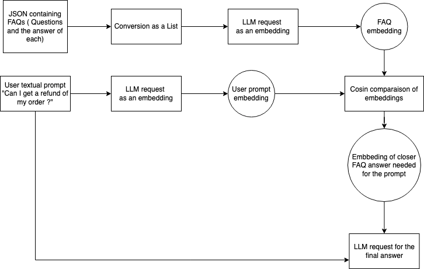

# GenAI for services

### Notebook usage

You can use [Google Colab](https://colab.research.google.com/) for a simple to use notebook environment for machine learning and data science. It will provide a container with all the necessary libraries and tools to run your code and live editing interface through a browser.

A notebook is a document that contains live code, equations, visualizations, and narrative text. You can use Colab to create, share, and collaborate on Jupyter notebooks with others.

With a notebooks you can :
* Prototype your ideas
* easily share your work with others
* collaborate with others

::: tip User interaction with Colab

You can store your API keys safely in the `userdata` of your Colab environment.
Also you can upload files to your Colab environment as follows:

```python
from google.colab import files
from google.colab import userdata  # For retrieving API keys

# 1. Upload the file to your current colab environment ( a upload button will appear at the execution of the code)
uploaded = files.upload()
for fn in uploaded.keys():
    print('User uploaded file "{name}" with length {length} bytes'.format(
        name=fn, length=len(uploaded[fn])))

# get the API key from colab userdata ( left panel of colla, picto with the key)
api_key=userdata.get('API_KEY')
```

:::

## Dialog with LLMs REST APIs (Mistral)

::: tip configuration
**To set Up Your Environment**

- Install the necessary packages using pip:
  ```bash
  pip install requests langchain langchain_mistralai
  ```

**To obtain API Keys**

- Obtain an API key for the Mistral API [here](https://console.mistral.ai/api-keys/)
  :::

#### Main endpoints

| Endpoint         | URL                                                             | Description                                                                            |
| ---------------- | --------------------------------------------------------------- | -------------------------------------------------------------------------------------- |
| Models           | [/v1/models](https://api.mistral.ai/v1/models)                     | List models that are available with your account.                                      |
| Chat Completions | [/v1/chat/completions](https://api.mistral.ai/v1/chat/completions) | Completion means that the LLM will generate a response based on the prompt.            |
| Embeddings       | [/v1/embeddings](https://api.mistral.ai/v1/embeddings)             | Embeddings means that the LLM will generate a vector representation of the input text. |

```bash
curl -H "Authorization: Bearer <your_api_key>" https://api.mistral.ai/v1/models
```

output :

```json
[
  {
    "id": "text-davinci-003",
    "object": "model",
    "owned_by": "user-123456789",
    "permission": [
      {
        "id": "user-123456789",
        "object": "permission",
        "allow_create_engine": true,
        "allow_sampling": true,
        "allow_logprobs": true,
        "allow_search": true,
        "allow_view": true,
        "allow_fine_tuning": true,
        "organization": "org-123456789",
        "group": null,
        "is_blocking": false
      }
    ]
  }
  ...
]
```

#### JSON mode

**JSON mode** is a feature that allows you to send structured data to the model through the API instead of a text prompt. To use JSON mode, you need to select the right endpoint in the API explorer and specify the input format as JSON in the prompt.

For OpenAI API, you can use the following format :

```json
{
  "model": "text-davinci-003",
  "prompt": "Translate the following text to French: 'Hello, how are you?'",
  "max_tokens": 100
}
```

```bash
curl -H "Authorization: Bearer <your_api_key>" -H "Content-Type: application/json" -d '{"model": "text-davinci-003", "prompt": "Translate the following text to French: 'Hello, how are you?'", "max_tokens": 100}' https://api.mistral.ai/v1/chat/completions

{
  "id": "chatcmpl-123456789",
  "object": "chat.completion",
  "created": 1679341456,
  "model": "text-davinci-003",
  "choices": [
    {
      "index": 0,
      "message": {
        "role": "assistant",
        "content": "Bonjour, comment ça va?"
      },
      "finish_reason": "stop"
    }
  ],
  "usage": {
    "prompt_tokens": 5,
    "completion_tokens": 7,
    "total_tokens": 12
  }
}
```

#### Structured Outputs

`Structured outputs` are a feature that allows you to receive structured data from the model through the API. It is useful for working with models that require structured outputs, such as JSON.

To use structured outputs, you need to select the right endpoint in the API explorer and specify the output format in the prompt.

for OpenAI API, you can use the following format :

```json
{
  "model": "text-davinci-003",
  "prompt": "Translate the following text to French: 'Hello, how are you?'",
  "max_tokens": 100,
  "output": "json"
}
```

the structured output can be as follow :

```json
{
  "model": "text-davinci-003",
  "prompt": "Translate the following text to French: 'Hello, how are you?'",
  "max_tokens": 100,
  "output": {
    "text": "Bonjour, comment ça va?"
  }
}
```

## 🧪 Exercises

#### Request an LLM with with basic REST request

Create a Python application that generates humorous motivational quotes for developers based on their name, favorite programming language, and a brief description of their current project or challenge.

::: tip Library for making API calls
You can use [requests](https://requests.readthedocs.io/en/latest/) for making API calls in Python.
:::

**Expected Output**

```bash
Enter your name: Ibrahim
Enter your favorite programming language: kotlin
Enter your current project description: conference app with KMP

--- Motivational Quote ---
Quote: "Code like you just ate a burrito... with passion, speed, and a little bit of mess!"
Author: Unknown
--------------------------
```

- [API Model list](https://docs.mistral.ai/api/#tag/models/operation/list_models_v1_models_get)
- [Chat completions](https://docs.mistral.ai/api/#tag/chat/operation/chat_completion_v1_chat_completions_post)


::: details Solution
[Google Collab notebook](https://colab.research.google.com/drive/1CHb_WX3kZaCKShHdCI-4zut1Ro0HqgPd?usp=sharing)
:::


## Context aware frameworks (LangChain)

LangChain is a framework for building applications powered by language models (LLMs) like OpenAI's GPT-3. It provides a set of tools and utilities for working with LLMs, including prompt engineering, chain of thought, and memory management. LangChain is designed to be modular and extensible, allowing developers to easily integrate with different LLMs and other AI services.
Finally it enables to build agents and complex workflows on top of LLMs.

#### LLM supports

Depending on the LLM, LangChain provides different APIs. Have a look at the following table [here](https://python.langchain.com/docs/integrations/chat/) to see which APIs are available for your LLM.


Mistral AI Chat Model is supported by LangChain and provides the following features:

| Model Features | Tool Calling | Structured Output | JSON Mode | Image Input | Audio Input | Video Input |
| -------------- | ------------ | ----------------- | --------- | ----------- | ----------- | ----------- |
|                | ✅           | ✅                | ✅        | ❌          | ❌          | ❌          |

To use langchain with mistral, you need to install the `langchain_mistralai` package and create a `ChatMistralAI` object.

```python
from langchain_mistralai.chat_models import ChatMistralAI
# Define your API key and model
API_KEY = 'your_api_key'  # Replace with your actual Mistral API key
MISTRAL_API_URL = 'https://api.mistral.ai/v1/chat/completions'
llm = ChatMistralAI(api_key=API_KEY, model="open-mistral-7b")
```

#### Prompt templating

[`Prompt templating`](https://python.langchain.com/api_reference/core/prompts/langchain_core.prompts.prompt.PromptTemplate.html#prompttemplate) is a powerful feature that allows you to create dynamic prompts based on the input data. It enables you to generate prompts that are tailored to the specific requirements of your application.

```python
from langchain.prompts import PromptTemplate

prompt = PromptTemplate(
    input_variables=["text", "language"],
    template="translate the following text to {language}: {text}",
)
```

#### Chaining

[`Chain`](https://python.langchain.com/v0.1/docs/modules/chains/) Chains refer to sequences of calls - whether to an LLM, a tool, or a data pre-processing step. It is a sequence of calls that are executed in order, with the output of one call being the input for the next call.It enables you to create complex workflows by combining the output of one LLM call with the input of another. This is useful for tasks that require multiple steps or interactions with external systems.

```python
from langchain.chains import LLMChain

input_data = {
    "text": "Hello, how are you?",
    "language": "French"
}

chain = prompt | llm_model
response=chain.invoke(input_data)
```

Multiple prompt can be chained together to create complex workflows.

#### AIMessage

[AIMessage](https://api.python.langchain.com/en/latest/messages/langchain_core.messages.ai.AIMessage.html) is returned from a chat model as a response to a prompt. It contains the message type, content, and any additional parameters.


#### Tool/Function calling

[`Function/Tool calling`](https://python.langchain.com/docs/how_to/tool_calling/) is a feature that allows the llm to call existing functions from your code. It is useful for working with functions, such as APIs, and for interacting with models that require function calls. Once a tool function is created, you can register it as a tool within LangChain for being used by the LLM.

## RAG for services (llama-index)

[**llama-index**](https://docs.llamaindex.ai/en/stable/use_cases/q_and_a/) is a powerful tool for building and deploying RAG (Retrieval Augmented Generation) applications. It provides a simple and efficient way to integrate LLMs into your applications, allowing you to retrieve relevant information from a large knowledge base and use it to generate responses. RAG is a technique that leverages the power of LLMs to augment human-generated content.

### RAG over Unstructured Documents

Unstructured documents are a common source of information for RAG applications. These documents can be in various formats, such as text, PDF, HTML, or images. LlamaIndex provides tools for indexing and querying unstructured documents, enabling you to build powerful RAG applications that can retrieve information from a large corpus of documents.

```python
documents = SimpleDirectoryReader(input_files=[fn]).load_data()
index = SummaryIndex.from_documents(documents, settings=settings)
query_engine = index.as_query_engine(response_mode="tree_summarize", llm=llm)
response = query_engine.query("<your_query_here>")
```

### Question Answering (QA) over Structured Data (MySQL)

Structured Data is another common source of information for RAG applications. This data is typically stored in databases or spreadsheets and can be queried using SQL or other query languages. LlamaIndex provides tools for connecting LLMs to databases and querying structured data, allowing you to build RAG applications that can retrieve information from databases.

```python
#The database library used in this example is SQLAlchemy
sql_database = SQLDatabase(engine, include_tables=["books"])
query_engine = NLSQLTableQueryEngine(
    sql_database=sql_database,
    tables=["books"],
    llm=llm,
    embed_model=embed_model,
)

query_engine.query("Who wrote 'To Kill a Mockingbird'?")
```


## 🧪 Exercise

#### Exercice 1 - Request an LLM with langchain

Create a Python application that generates humorous motivational quotes for developers based on their name, favorite programming language, and a brief description of their current project or challenge.

**Expected Output**

```bash
Enter your name: Ibrahim
Enter your favorite programming language: kotlin
Enter your current project description: conference app with KMP

--- Motivational Quote ---
Quote: "Code like you just ate a burrito... with passion, speed, and a little bit of mess!"
Author: Unknown
--------------------------
```

**Steps**

Create a function `get_developer_motivation(name, language, project_description)` that:

- Takes a developer's name, their favorite programming language, and a brief description of their current project or challenge as input.
- Uses LangChain to send a request to the LLM to generate a humorous motivational quote.
- Returns a structured response containing the quote, the developer's name, the programming language, and the project description.

::: details Solution
[Google Colab notebook](https://colab.research.google.com/drive/1oGPjmOlYPwTq19HGpY8PFhsX8OuwPK22?usp=sharing)
:::

#### Exercice 1.1 - Use langchain to request  Mistral AI API embedding endpoint to get the embedding of a text prompt

::: details Solution
[Google Colab notebook](https://colab.research.google.com/drive/1oGPjmOlYPwTq19HGpY8PFhsX8OuwPK22?usp=sharing)
:::


#### Exercice 1.2 - Let's use chaining to create a chain that compares the embeddings.

You have a json file with a list of FAQ questions and answers.
Let's request the Mistral AI API to get the embedding of a question and compare it with the embeddings of the FAQ questions to find the most similar one. Then return the question of the FAQ that is the most similar to the question asked to get the final answer from the LLM.

Here is the schema  :




::: details Solution
[Google Colab notebook](https://colab.research.google.com/drive/1vcAbbjEuADzLKo9xxwXu6QY8f1-Vnz4L?usp=sharing)
:::


#### Exercice 2 - Tool/Function calling : Request an LLM with Tool/Function calling


Build a command-line application that fetches weather data for a specified city using LangChain and a public weather API. The application will utilize implicit tool calling to allow the LLM to decide when to call the weather-fetching tool based on user input.

##### Output

```bash
Ask about the weather (e.g., 'Lille, France'): Paris

------------------------------------------------------------------------------
The current weather in Paris is: overcast clouds with a temperature of 6.63°C.
------------------------------------------------------------------------------
```

::: tip Configuration

- Sign up for an API key from a weather service provider (e.g., OpenWeatherMap). - You can generate your key [here](https://home.openweathermap.org/api_keys) - You can call the API as following :
  `bash curl https://api.openweathermap.org/data/2.5/weather?q=Lille&appid=<your_api_key>&units=metric `
  :::

##### Steps

**Create the Weather Fetching Function**

- Define a function `fetch_weather(city: str) -> dict` that takes a city name as input and returns the weather data as a dictionary. Use the weather API to fetch the data.

**Register the Weather Tool**

- Use the [`Tool`](https://python.langchain.com/docs/concepts/tools/) class from LangChain to register the `fetch_weather` function as a tool.

**Set Up the LangChain Components**

- Create a prompt template that asks about the weather in a specified city.
- Instantiate the `ChatMistralAI` model with your Mistral API key.
- Create a chain that combines the prompt template, the chat model, and the registered weather tool.

**Handle User Input**

- Implement a function `handle_user_input(city)` that:
  - Takes user input for the city name.
  - Invokes the chain with the input data.
  - Checks if the response includes [`tool calls`](https://python.langchain.com/docs/how_to/tool_calling/).
  - Extracts the function name and arguments from the tool call and invokes the weather tool if necessary.
  - Returns the weather information or the LLM's response.

**Run the Application**

- Prompt the user to enter a city name.
- Call the `handle_user_input` function with the provided city name and display the result.


::: details Solution
[Google Collab notebook](https://colab.research.google.com/drive/16B84XU5dl2UR5XZkRtnh3MWUK0K5ZBd_?usp=sharing)
:::


#### Exercice 3 - RAG : Querying on Unstructured Documents

Create a Python application that provide a txt document containings a list of application comments and make sentiment analysis on it with `llama-index`.

Your customer review txt file :

```text
Review 1: I was very disappointed with the product. It did not meet my expectations.
Review 2: The service was excellent! I highly recommend this company.
Review 3: I had a terrible experience. The product was faulty, and the customer support was unhelpful.
Review 4: I am extremely satisfied with my purchase. The quality is outstanding.
```

**Expected Shell Output:**

```bash
Saving customer_reviews.txt to customer_reviews (4).txt
User uploaded file "customer_reviews (4).txt" with length 338 bytes
The customers' experiences with the company and its products vary. Some have had positive experiences, such as excellent service and high-quality products, while others have encountered issues with faulty products and unhelpful customer support.
```


::: details Solution
[Google Collab notebook](https://colab.research.google.com/drive/1HRVqcYEl2RLQDQ8l4NoGcdxiqU-6CgJa?usp=sharing)
:::


##### Exercice 4 - RAG : Querying SQL Databases with Natural Language

Create a Python application that initializes a list of languages and their creators with `sqlalchemy` and requests the LLM to retrieve the creators of a language.
The LLM should be able to understand the context and retrieve the relevant information from the database.

**Expected Shell Output:**

```bash
[
    {
        "language_name": "Python",
        "creator": "Guido van Rossum",
        "year_created": 1991
    },
    {
        "language_name": "JavaScript",
        "creator": "Brendan Eich",
        "year_created": 1995
    },
    {
        "language_name": "Java",
        "creator": "James Gosling",
        "year_created": 1995
    },
    {
        "language_name": "C++",
        "creator": "Bjarne Stroustrup",
        "year_created": 1985
    }
]
Guido van Rossum created Python in 1991.
```

:::tip Solution
[Google Collab notebook](https://colab.research.google.com/drive/1osoFUAxRbZayftaTlCtJIqlWlj_0c3sQ?usp=sharing)
:::


## (Vector databases )


### Usage of Chroma
Chroma is a vector database that allows you to store and query vectors of data. Lanchain provides a simple and efficient way to integrate [Chroma](https://www.trychroma.com/) into your applications, allowing you to store and query vectors of data using LLMs.

Please refer to the [Langchain vector  documentation](https://python.langchain.com/v0.1/docs/modules/data_connection/vectorstores/) for more information on how to use Chroma.

## 📖 Further readings
