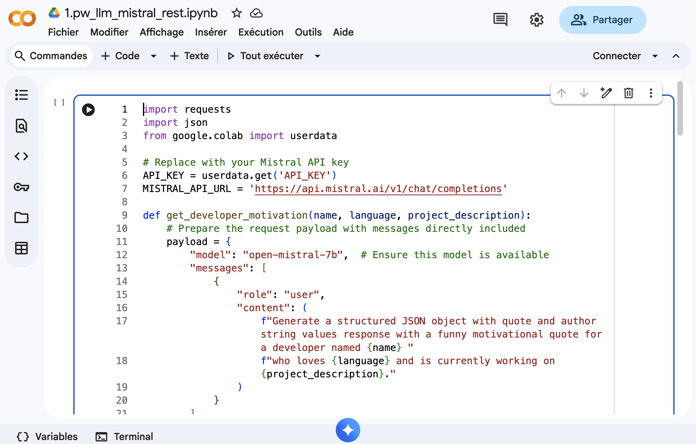

# GenAI for services

This section is dedicated to the usage of Generative AI models for services applications. We will explore how to interact with LLMs from simple REST API calls to more complex frameworks that enable context aware applications and agentic behaviors.

::: tip Modalities for this training

1. We will use **[Mistral AI](https://mistral.ai/)** as the main LLM provider. Mistral AI provides free access to their models through REST APIs with a free tier making onboarding easy and fast. 
- Sign up or log in here : [Mistral AI login](https://v2.auth.mistral.ai/login)
- and get your API key here : [Mistral AI API keys](https://console.mistral.ai/home?profile_dialog=api-keys).

2. Also we choose **Python** as the main programming language for this training due to its popularity in the AI/ML community and the availability of up-to-date libraries and frameworks, documentations and easy onboarding.

3. We will use **[Google Colab](https://colab.research.google.com/)** for an online use of jupyter notebooks. A notebook is an interactive environment for machine learning and data science. It is a single page document that contains both code and rich text elements (paragraphs, equations, figures, links, etc.) and allows you to run code in an interactive way.
With a notebook you can:
* Prototype your ideas
* Easily share your work with others
* Collaborate with others 
* Gemini is pre-installed in Google Colab environments so you can code with ease even if you're not familiar with Python development.

**NB: Please do not use, for now, Worldline email for connecting to Google Colab or you will have permission issues. If needed, create a dedicated Google account for that training.**
:::

### Google Colab notebooks



#### Store API keys 

You can store secret keys such as API keys in the `userdata` of your Colab environment. To do so, follow these steps:
1. Open the left sidebar in your Colab notebook.
2. Click on the "Userdata" tab (it looks like a key icon).
3. Click on the "Add key" button.
4. Enter a name for your key (e.g., `API_KEY`) and paste your API key in the value field.
5. Click "Save".  

Now you can retrieve the API key in your Colab notebook as follows:

```python
from google.colab import userdata  # For retrieving API keys
# get the API key from colab userdata ( left panel of colla, picto with the key)
api_key=userdata.get('API_KEY')
```

#### Importing libraries

To setup your Colab environment with third party libraries, you can use the `pip` command directly in a code cell as follows:
```python
!pip install <library-name>
```

After clicking on the play button of the code cell, the library will be installed in your Colab environment and you can import it as usual in the next code cells.


## LLMs with REST APIs 

#### OpenAI API standard

OpenAI provides a set of standard endpoints for interacting with their LLMs. This standard is widely adopted by many LLM providers including Mistral AI. The main endpoints are as follows:
| Endpoint & Description | Method & URL | Header | Body | Response |
|----------|-----|--------|-----------|----------|
| **List Models**<br>Retrieve list of available models | GET `/v1/models` | `Authorization: Bearer {api_key}` | — | `{ "object": "list", "data": [...], "has_more": false }` |
| **Retrieve Model**<br>Get details of a specific model | GET `/v1/models/{model}` | `Authorization: Bearer {api_key}` | — | `{ "id": "gpt-4", "object": "model", "owned_by": "openai", "permission": [...], "created": 1234567890 }` |
| **Chat Completions**<br>Generate chat-based responses | POST `/v1/chat/completions` | `Authorization: Bearer {api_key}`<br>`Content-Type: application/json` | `{ "model": "gpt-4", "messages": [{"role": "system", "content": "..."}, {"role": "user", "content": "..."}], "temperature": 0.7, "max_tokens": 100, "top_p": 1 }` | `{ "id": "chatcmpl-abc123", "object": "chat.completion", "created": 1234567890, "model": "gpt-4", "choices": [{ "index": 0, "message": {"role": "assistant", "content": "..."}, "finish_reason": "stop" }], "usage": { "prompt_tokens": 10, "completion_tokens": 20, "total_tokens": 30 } }` |
| **Embeddings**<br>Generate vector embeddings for text | POST `/v1/embeddings` | `Authorization: Bearer {api_key}`<br>`Content-Type: application/json` | `{ "model": "text-embedding-3-small", "input": "Hello world", "encoding_format": "float" }` | `{ "object": "list", "data": [{ "object": "embedding", "embedding": [0.123, -0.456, ...], "index": 0 }], "model": "text-embedding-3-small", "usage": { "prompt_tokens": 3, "total_tokens": 3 } }` |

API references for Mistral AI :
- [Chat Endpoints - GET](https://docs.mistral.ai/api/#tag/models/operation/list_models_v1_models_get)
- [Chat Endpoints - POST](https://docs.mistral.ai/api/#tag/chat/operation/chat_completion_v1_chat_completions_post)


You can test these endpoints here:

<RestLlmTester />

#### Structured Outputs

[`Structured Outputs`](https://platform.openai.com/docs/guides/structured-outputs) is a feature that ensures the model will always generate responses that adhere to your supplied [JSON Schema](https://platform.openai.com/docs/api-reference/chat/create#chat_create-response_format), so you don't need to worry about the model omitting a required key, or hallucinating an invalid enum value.

Some benefits of Structured Outputs include:
- Reliable type-safety: No need to validate or retry incorrectly formatted responses
- Explicit refusals: Safety-based model refusals are now programmatically detectable
- Simpler prompting: No need for strongly worded prompts to achieve consistent formatting

Structured Outputs is the evolution of [`JSON mode`](https://docs.mistral.ai/capabilities/structured_output/json_mode). While both ensure valid JSON is produced, only Structured Outputs ensure schema adherence.

**Example**
```python
import requests
import json

api_key = "your-api-key"
url = "https://api.openai.com/v1/chat/completions"

payload = {
    "model": "gpt-4",
    "messages": [{"role": "user", "content": "Extract: John is 28 and lives in Paris"}],
    "response_format": {
        "type": "json_schema",
        "json_schema": {
            "name": "person",
            "schema": {
                "type": "object",
                "properties": {
                    "name": {"type": "string"},
                    "age": {"type": "integer"},
                    "city": {"type": "string"}
                }
            }
        }
    }
}

headers = {
    "Authorization": f"Bearer {api_key}",
    "Content-Type": "application/json"
}

response = requests.post(url, json=payload, headers=headers)
result = json.loads(response.json()["choices"][0]["message"]["content"])
print(result)
```
**Output**
```python
{'name': 'John', 'age': 28, 'city': 'Paris'}
``` 

## 🧪 Exercises

#### Exercise 01 — REST API

Create a Python application that generates humorous motivational quotes for developers based on their name, favorite programming language, and a brief description of their current project or challenge.

::: tip Library for making API calls
You can use [requests](https://requests.readthedocs.io/en/latest/) for making API calls in Python.
:::

**Expected Output**

```bash
Enter your name: Ibrahim
Enter your favorite programming language: kotlin
Enter your current project description: conference app with KMP

--- Motivational Quote ---
Quote: "Code like you just ate a burrito... with passion, speed, and a little bit of mess!"
Author: Unknown
--------------------------
```

::: warning How to start ?
[](https://colab.research.google.com/drive/1ZSQKYENLtjJqI7EvujcDS1O8SRvWq_n-#copy=true)
:::

::: tip solution
  ::: details here
  [](https://colab.research.google.com/drive/1rE_jC4DhD33Ni8MR9YTGK9WhykOTtbcF?usp=sharing)
  :::
:::

## Context aware frameworks (LangChain)

LangChain is a framework for building applications powered by language models (LLMs) like OpenAI's GPT-3. It provides a set of tools and utilities for working with LLMs, including prompt engineering, chain of thought, and memory management. LangChain is designed to be modular and extensible, allowing developers to easily integrate with different LLMs and other AI services.
Finally it enables to build agents and complex workflows on top of LLMs.

### Request LLMs

#### Chat models

Depending on the LLM, LangChain provides different APIs that are called ChatModels. These models are designed to handle conversational interactions with the LLM, allowing you to send messages and receive responses in a chat-like format.
Have a look at the following table [here](https://python.langchain.com/docs/integrations/chat/) to see which APIs are available for your LLM.

Mistral AI Chat Model is supported by LangChain and provides the following features:

| Model Features | Tool Calling | Structured Output | JSON Mode | Image Input | Audio Input | Video Input |
| -------------- | ------------ | ----------------- | --------- | ----------- | ----------- | ----------- |
|                | ✅           | ✅                | ✅        | ❌          | ❌          | ❌          |

To use langchain with mistral, you need to install the `langchain_mistralai` package and create a `ChatMistralAI` object.

```python
from langchain_mistralai.chat_models import ChatMistralAI
# Define your API key and model
API_KEY = 'your_api_key'  # Replace with your actual Mistral API key
MISTRAL_API_URL = 'https://api.mistral.ai/v1/chat/completions'
llm = ChatMistralAI(api_key=API_KEY, model="open-mistral-7b")
```

#### Prompt template

[`Prompt templating`](https://reference.langchain.com/python/langchain_core/prompts/) is a powerful feature that allows you to create dynamic prompts based on the input data. It enables you to generate prompts that are tailored to the specific requirements of your application.

```python
from langchain.prompts import PromptTemplate

prompt = PromptTemplate(
    input_variables=["text", "language"],
    template="translate the following text to {language}: {text}",
)
```

#### Chaining

[`Chain`](https://python.langchain.com/v0.1/docs/modules/chains/) Chains refer to sequences of calls - whether to an LLM, a tool, or a data pre-processing step. It is a sequence of calls that are executed in order, with the output of one call being the input for the next call.It enables you to create complex workflows by combining the output of one LLM call with the input of another. This is useful for tasks that require multiple steps or interactions with external systems.

Chains can be created using the `|` operator to combine different components, such as prompts and LLM models.

```python
from langchain.chains import LLMChain

input_data = {
    "text": "Hello, how are you?",
    "language": "French"
}

chain = prompt | llm_model
response=chain.invoke(input_data)
```

#### AIMessage

[AIMessage](https://docs.langchain.com/oss/python/langchain/messages#ai-message) represents the output of a model invocation. They can include multimodal data, tool calls, and provider-specific metadata that you can later access

```json
{
  "type": "ai",
  "content": "The capital of France is Paris. It is located in northern-central France and is known for its iconic landmarks like the Eiffel Tower, Notre-Dame Cathedral, and the Louvre Museum.",
  "response_metadata": {
    "token_usage": {
      "completion_tokens": 31,
      "prompt_tokens": 15,
      "total_tokens": 46
    },
    "model_name": "gpt-4",
    "finish_reason": "stop"
  },
  "id": "run-abc123-xyz789",
  "name": null,
  "example": false
}
```
#### Output Parsers

[`Output Parsers`](https://docs.langchain.com/oss/python/langchain/output_parsers/) are used to parse the output of an LLM into a structured format. They enable you to extract specific information from the LLM's response, making it easier to work with the data.

```python
from langchain.output_parsers import JsonOutputParser
output_parser = JsonOutputParser()
response = llm("Generate a JSON object with name and age")
parsed_output = output_parser.parse(response)
```

### 🧪 Exercises

#### Exercise 02 — LangChain Basics

Create a Python application that generates humorous motivational quotes for developers based on their name, favorite programming language, and a brief description of their current project or challenge.

**Expected Output**

```bash
Enter your name: Ibrahim
Enter your favorite programming language: kotlin
Enter your current project description: conference app with KMP

--- Motivational Quote ---
Quote: "Code like you just ate a burrito... with passion, speed, and a little bit of mess!"
Author: Unknown
--------------------------
```

::: warning How to start ?
[](https://colab.research.google.com/drive/1YA6ZhjPiqJkOiPk9Q8UzVYkcvXxJ9kNr?#copy=true)
:::

::: tip solution
  ::: details here
  [](https://colab.research.google.com/drive/1Q9VbNSdsSEiEI6qvteQGubMBSzemRPSa?usp=sharing)
  :::
:::


### Tools

[`Function/Tool calling`](https://docs.langchain.com/oss/python/langchain/tools#tools) is a feature that allows the LLM to call existing functions from your code. It is useful for allowing the LLM to interact wiht external APIs or other models that require function calls. Once a tool function is created, you can register it as a tool within LangChain for being used by the LLM.

#### Create a tool

**With annotated function**
```python
@tool(name_or_callable="do_something", description="this tool does something.")
def some_function(arg: str) -> dict:
    return {"output": f"Did something with {arg}"}
``` 

**With Tool class**
```python
a_tool = Tool(
    name="do_something",
    description="this tool does something",
    func=some_function
)
```
#### Bind tool to LLM
You can bind the tool to the LLM using the `bind_tools` method. This allows the LLM to call the tool when needed.

```python
llm_with_tools = llm.bind_tools([weather_tool])
```

#### Handle tool calls
You can handle tool calls by checking if the response from the LLM includes any tool calls. If a tool call is detected, you can extract the function name and arguments from the tool call and invoke the corresponding tool function.
```python
response = llm_with_tools.invoke(input_data)

f 'tool_calls' in response.additional_kwargs:
        # Extract the tool call information
        tool_calls = response.additional_kwargs['tool_calls']

        for tool_call in tool_calls:
            # Extract the function object and arguments
            function_info = tool_call['function']
            function_name = function_info['name']
            arguments = function_info['arguments']
             if function_name == 'some_tool':
                # Call the tool function with the extracted arguments
                tool_response = some_tool(**arguments)
                return tool_response
```

### 🧪 Exercises

#### Exercise 03 — Tool Calling

Build a command-line application that fetches weather data for a specified city using LangChain and a public weather API. The application will utilize implicit tool calling to allow the LLM to decide when to call the weather-fetching tool based on user input.

This exercise uses **[Open-Meteo](https://open-meteo.com/)** — a free weather API that requires **no API key**. It is combined with **[Nominatim](https://nominatim.org/)** (OpenStreetMap) to geocode the city name to coordinates.

| Step | Endpoint | Description |
| ---- | -------- | ----------- |
| 1. Geocode | `https://nominatim.openstreetmap.org/search?q=<city>&format=json&limit=1` | Returns `lat` / `lon` for the city |
| 2. Weather | `https://api.open-meteo.com/v1/forecast?latitude=<lat>&longitude=<lon>&current_weather=true` | Returns current temperature, wind speed, and weather code |

**Expected output**

```bash
Ask about the weather (e.g., 'Lille, France'): Paris

------------------------------------------------------------------------------
The current weather in Paris is: overcast clouds with a temperature of 6.63°C.
------------------------------------------------------------------------------
```

::: warning How to start ?
[](https://colab.research.google.com/drive/1dK3C9p9aMbjcK6PHmTKZQYpIcH4A4ZTn?#copy=true)
:::

::: tip Solution
  ::: details here
    [](https://colab.research.google.com/drive/16B84XU5dl2UR5XZkRtnh3MWUK0K5ZBd_?usp=sharing)
  :::
:::

## RAG  with llama-index

[**llama-index**](https://docs.llamaindex.ai/en/stable/use_cases/q_and_a/) is a powerful tool for building and deploying RAG (Retrieval Augmented Generation) applications. It provides a simple and efficient way to integrate LLMs into your applications, allowing you to retrieve relevant information from a large knowledge base and use it to generate responses. RAG is a technique that leverages the power of LLMs to augment human-generated content.

### RAG over Unstructured Documents

Unstructured documents are a common source of information for RAG applications. These documents can be in various formats, such as text, PDF, HTML, or images. LlamaIndex provides tools for indexing and querying unstructured documents, enabling you to build powerful RAG applications that can retrieve information from a large corpus of documents.

```python
documents = SimpleDirectoryReader(input_files=[fn]).load_data()
index = SummaryIndex.from_documents(documents, settings=settings)
query_engine = index.as_query_engine(response_mode="tree_summarize", llm=llm)
response = query_engine.query("<your_query_here>")
```

### 🧪 Exercises

::: tip Uploading files in Google Colab
```python
from google.colab import files

# A file picker will appear when this cell runs
uploaded = files.upload()
for fn in uploaded.keys():
    print('User uploaded file "{name}" with length {length} bytes'.format(
        name=fn, length=len(uploaded[fn])))
# The file is now available in the current Colab environment
```
:::

#### Exercise 04 — Unstructured RAG

Create a Python application that performs sentiment analysis on a set of customer reviews using `llama-index`. The LLM reads the uploaded document and summarises the overall customer sentiment.

::: warning Before opening the notebook
Create a file named `customer_reviews.txt` on your computer with the content below — you will be asked to upload it inside Colab.
:::

```text
Review 1: I was very disappointed with the product. It did not meet my expectations.
Review 2: The service was excellent! I highly recommend this company.
Review 3: I had a terrible experience. The product was faulty, and the customer support was unhelpful.
Review 4: I am extremely satisfied with my purchase. The quality is outstanding.
```

**Expected output:**

```bash
Saving customer_reviews.txt to customer_reviews (4).txt
User uploaded file "customer_reviews (4).txt" with length 338 bytes
The customers' experiences with the company and its products vary. Some have had positive experiences, such as excellent service and high-quality products, while others have encountered issues with faulty products and unhelpful customer support.
```

::: warning How to start ?
[](https://colab.research.google.com/drive/1_1CpaIHiu3bfSlpGamhOtTH-SRCpSB2q?#copy=true)
:::

::: tip Solution    
  ::: details here
    [](https://colab.research.google.com/drive/1HRVqcYEl2RLQDQ8l4NoGcdxiqU-6CgJa?usp=sharing)
  :::
:::

###  Question Answering (QA) over Structured Data (MySQL)

Structured Data is another common source of information for RAG applications. This data is typically stored in databases or spreadsheets and can be queried using SQL or other query languages. LlamaIndex provides tools for connecting LLMs to databases and querying structured data, allowing you to build RAG applications that can retrieve information from databases.

```python
#The database library used in this example is SQLAlchemy
sql_database = SQLDatabase(engine, include_tables=["books"])
query_engine = NLSQLTableQueryEngine(
    sql_database=sql_database,
    tables=["books"],
    llm=llm,
    embed_model=embed_model,
)

query_engine.query("Who wrote 'To Kill a Mockingbird'?")
```

### 🧪 Exercises

#### Exercise 05 — Structured RAG SQL

Create a Python application that initializes a list of languages and their creators with `sqlalchemy` and requests the LLM to retrieve the creators of a language.
The LLM should be able to understand the context and retrieve the relevant information from the database.

**Expected Shell Output:**

```bash
[
    {
        "language_name": "Python",
        "creator": "Guido van Rossum",
        "year_created": 1991
    },
    {
        "language_name": "JavaScript",
        "creator": "Brendan Eich",
        "year_created": 1995
    },
    {
        "language_name": "Java",
        "creator": "James Gosling",
        "year_created": 1995
    },
    {
        "language_name": "C++",
        "creator": "Bjarne Stroustrup",
        "year_created": 1985
    }
]
Guido van Rossum created Python in 1991.
```

::: warning How to start ?
[](https://colab.research.google.com/drive/1Gvzue-0s4NYvKIKFDNtj6y_a1wdNSWbO?#copy=true)
:::

::: tip Solution
  ::: details here
   [](https://colab.research.google.com/drive/1osoFUAxRbZayftaTlCtJIqlWlj_0c3sQ?usp=sharing)
  :::
:::


## Embeddings 

Embeddings are numerical representations of words, phrases, or entire documents in a continuous vector space. They capture semantic relationships between different pieces of text, allowing LLMs to understand context and meaning more effectively. An Embedding is the specialization of a Vector in the context of language models.

It can be useful to store embeddings in a vector database to enable efficient similarity search and retrieval of relevant information and have cost effective solutions for large scale applications.

Contesxt aware frameworks like LangChain provide easy to use APIs to interact with embedding endpoints of LLM providers.

```python
from langchain_mistralai.embeddings import MistralAIEmbeddings
````


## 🧪 Exercises

#### Exercise 06 — LangChain Embeddings

Extend the LangChain motivational quote exercise by also computing and displaying the **embedding vector** of the rendered prompt using `MistralAIEmbeddings`. This exercise demonstrates how to combine text generation and vector representation in a single pipeline.

::: warning How to start ?
[](https://colab.research.google.com/drive/1O5cnBQdX1CpvKL8_IkHfkFXlhYwsGXMy?#copy=true)
:::

::: tip Solution
  ::: details here
   [](https://colab.research.google.com/drive/1oGPjmOlYPwTq19HGpY8PFhsX8OuwPK22?usp=sharing)
  :::
:::

#### Exercise 07 — FAQ Semantic Search

Given a list of FAQ questions and answers, use Mistral AI embeddings and cosine similarity to find the most semantically relevant FAQ entry for a user question, then pass the matched context to the LLM for a grounded final answer.

::: details Pipeline schema
<Mermaid :value="`
flowchart TD
A[JSON FAQs
Questions & Answers] --> B[Convert to List]
B --> C[LLM Embedding
Request]
C --> D((FAQ
Embedding))
E[User Prompt
Can I get refund?] --> F[LLM Embedding
Request]
F --> G((User
Embedding))
D --> H[Cosine
Comparison]
G --> H
H --> I((Closest FAQ
Match))
I --> J[LLM Final
Response]
classDef default fill:#e1f5fe,stroke:#01579b,stroke-width:2px,color:#000
classDef circle fill:#bbdefb,stroke:#1565c0,stroke-width:2px,color:#000
class D,G,I circle
`" />
:::

::: warning How to start ?
[](https://colab.research.google.com/drive/1Mdw_Ac0raY_vZeTjH4U_436J42cyHmoi?#copy=true)
:::

::: tip Solution
  ::: details here
    [](https://colab.research.google.com/drive/1vcAbbjEuADzLKo9xxwXu6QY8f1-Vnz4L?usp=sharing)
  :::
:::

## Vector databases

A vector database is a specialized database designed to store and retrieve high-dimensional vectors efficiently. It is particularly useful for applications involving similarity search, such as image recognition, recommendation systems, and natural language processing.

### Usage of Chroma
Chroma is a vector database that allows you to store and query vectors of data. LangChain provides a simple and efficient way to integrate [Chroma](https://www.trychroma.com/) into your applications, allowing you to store and query vectors of data using LLMs.

Please refer to the [LangChain vector documentation](https://python.langchain.com/v0.1/docs/modules/data_connection/vectorstores/) for more information on how to use Chroma.

## 📖 Further readings
