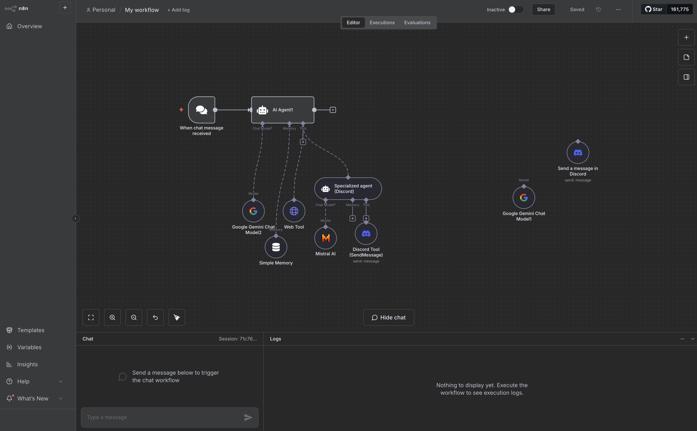

# Agentic AI node-based 

Node based genAI tools allow users to create and manage AI workflows using a visual interface that represents different components as nodes. These nodes can be connected to define the flow of data and operations, making it easier for users to build complex AI applications without extensive coding knowledge.

It is still for developers an option to consider, as it allows rapid prototyping and testing of AI workflows, enabling developers to focus on higher-level design and logic rather than low-level implementation details.

## N8N



[N8N](https://n8n.io/) is an open-source workflow automation tool that enables you to connect various applications and services to automate tasks and processes. It provides a visual interface where you can create workflows by dragging and dropping nodes that represent different actions or triggers.

#### Key Features of N8N
- **Visual Workflow Builder**: N8N offers a user-friendly visual interface that allows you to create complex workflows without writing code. You can easily connect different nodes to define the flow of data and actions.
- **Extensive Integrations**: N8N supports a wide range of integrations with popular applications and services, including databases, APIs, cloud services, and more. This allows you to automate tasks across different platforms seamlessly.
- **Custom Nodes**: You can create custom nodes using JavaScript, allowing you to extend N8N's functionality to meet your specific needs.
- **Self-Hosting**: N8N can be self-hosted, giving you full control over your data and workflows. This is particularly important for organizations with strict data privacy requirements. It's also a one command installation with node js :
``` node
npx n8n
```

- **Open Source**: N8N is open-source software, which means you can contribute to its development, customize it, and use it without licensing fees.

::: tip Specialized node based genAI tools
More specic node-based genAI tools like comfyUI do the same for image generation workflows.
:::

## Agentic architecture 

Agentic architectures involve the use of multiple specialized agents that work together to achieve complex tasks. Each agent is designed to perform specific functions, and they communicate and collaborate to accomplish the overall goal.

With node-based tools, you can create workflows that involve multiple agents, each responsible for a specific aspect of the task. For example, in a content generation workflow, you might have one agent for text generation, another for image creation, and a third for data analysis. These agents can be represented as nodes in the workflow, allowing you to visualize and manage their interactions.

### DEMO


### 🧪 Exercise

Create a simple workflow using N8N that involves multiple agents working together to achieve a specific task. 
We want to search on the web the soccer results of the last weekend, summarize it with a long reasonning LLM, and send to discord channel the markdown formatted summary with a specialized LLM.

Multiple nodes will be needed and there is multiple ways to achieve this.
Remember that each node will require configuration, including API keys for the services you will use.
You can use Gemini Pro as reasonning LLM and Mistral AI for specialized agents.


## 📖 Further readings

* [The Yoga of Image Generation – Part 1](https://blog.worldline.tech/2025/02/11/sd-comfyui-part1.html)
* [The Yoga of Image Generation – Part 2](https://blog.worldline.tech/2025/04/14/sd-comfyui-part2.html)
* [The Yoga of Image Generation – Part 3](https://blog.worldline.tech/2025/06/24/sd-comfyui-part3.html)
* [Relay.ai](https://www.relay.app/?_sm_vck=Jq0QMVqMPr7RtrJHNJ3ZSFfj0H0P2ns56Nr2snrMQD3MVq7vrMwQ)
* [Make.com](https://www.make.com/en)
* [n8n](https://n8n.io/)
* [Flowise](https://flowiseai.com/) 