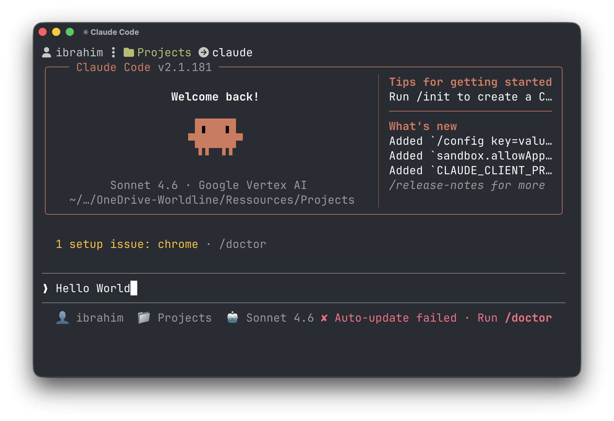
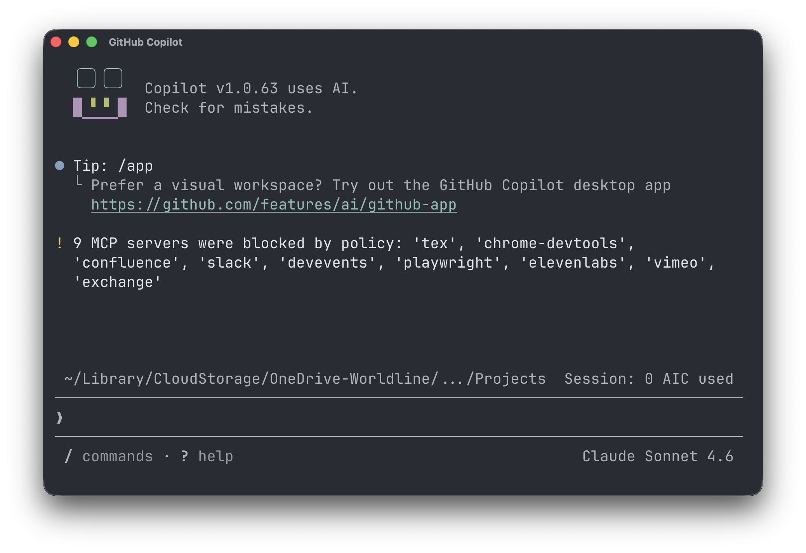

# Agentic AI in the Terminal

## Agentic CLIs

Agentic CLI tools bring AI autonomy directly into the developer's terminal. Unlike chat-based assistants, these tools can understand a goal, plan the steps, browse files, run commands, write and test code — all autonomously within your local environment. They represent a shift from AI *suggestion* to AI *execution*, accelerating complex developer tasks end-to-end.

<div style="display:flex;gap:1rem;flex-wrap:wrap;">
  
  
</div>

| Tool | Publisher | Install / Docs |
|------|-----------|----------------|
| [Claude Code](https://docs.anthropic.com/en/docs/claude-code) | Anthropic | `npm install -g @anthropic-ai/claude-code` |
| [GitHub Copilot CLI](https://docs.github.com/en/copilot/github-copilot-in-the-cli) | GitHub | `gh extension install github/gh-copilot` |
| [OpenAI Codex CLI](https://github.com/openai/codex) | OpenAI | `npm install -g @openai/codex` |
| [Gemini CLI](https://github.com/google-gemini/gemini-cli) | Google | `npm install -g @google/gemini-cli` |
| [Google Antigravity](https://antigravity.google/) | Google | Early access — see website |

All these CLIs rely on the same principle: reading a context file at the root of the repository to understand the project without being re-briefed each time.

## 💬 Join the Community on Slack

::: tip Worldline Slack channels
- 🧠 **Share learnings and experiences:** [#ai-knowledge-sharing-hub](https://slack.com/archives/C0AL6QEDYLB)
- 🤖 **Claude Code dedicated channel:** [#ee-svc-claude-code](https://bambora.slack.com/archives/C0AH60KDJFP)
- 🐙 **GitHub Copilot dedicated channel:** [#ee-svc-github-copilot](https://bambora.slack.com/archives/C0B7G2GT865)
:::

## [AGENTS.md](https://agents.md/)

`AGENTS.md` is an open standard for that context file — a plain Markdown file placed at the root of a repository that tells any AI coding agent what it needs to know: build commands, conventions, testing rules, and project structure.

Each tool has its own equivalent: Claude Code reads `CLAUDE.md`, Cursor reads `.cursorrules`. AGENTS.md is the tool-agnostic version, now adopted across 30+ agents and 60,000+ repositories, governed by the **Agentic AI Foundation (AAIF)** under the Linux Foundation (alongside MCP).

### What goes in AGENTS.md

No required schema — just plain Markdown sections that matter to your project. Recommended content:

| Section | What to write |
|---------|--------------|
| **Overview** | What the project does, tech stack, entry points |
| **Build & run** | Exact commands to install, build, test, and start |
| **Conventions** | Naming, formatting, patterns the agent must follow |
| **Testing** | How to run tests, where they live, what coverage is expected |
| **Constraints** | Files or areas the agent should not touch |
| **PR / commit rules** | Branch naming, commit message format, review process |

### Example

```markdown
# AGENTS.md

## Build
npm install && npm run build

## Test
npm run test -- --watch=false

## Conventions
- Use TypeScript strict mode
- Components in src/components/, one file per component
- No default exports

## Constraints
- Do not modify generated files in src/generated/
```

### Relationship with tool-specific files

The recommended pattern is to keep `AGENTS.md` as the single source of truth and have tool-specific files simply reference it:

| Tool | Context file |
|------|-------------|
| Claude Code | `CLAUDE.md` |
| GitHub Copilot | `.github/copilot-instructions.md` |
| Cursor | `.cursorrules` |
| OpenAI Codex | `AGENTS.md` (native) |

```markdown
# CLAUDE.md
See AGENTS.md for full project context.
```

```markdown
# .github/copilot-instructions.md
See AGENTS.md for full project context.
```

One `AGENTS.md` to maintain, every agent benefits — regardless of which tool the developer uses.

## Skills

Skills are reusable, shareable units of knowledge that extend the capabilities of an agentic CLI. A skill packages a specific workflow, set of instructions, or domain expertise into a file that the CLI can load and apply on demand — without the user having to re-explain the context each time.

In Claude Code, a skill is a Markdown file with YAML frontmatter that defines when and how Claude should behave for a given task (e.g. writing a GitLab CI pipeline, reviewing a PR, generating a diagram). Skills can be installed globally and invoked via slash commands, making repetitive or team-specific workflows first-class citizens in the developer's terminal.

### Structure

A skill lives in its own directory under `~/.claude/skills/`:

```
~/.claude/skills/
└── gitlab-ci/
    └── SKILL.md        # the skill definition
```

The `SKILL.md` file uses YAML frontmatter to declare the skill's name, description, and trigger, followed by the instructions Claude will follow when the skill is invoked:

```markdown
---
name: gitlab-ci
description: Generate a GitLab CI/CD pipeline for this project
---

## Instructions

Analyze the project structure and generate a `.gitlab-ci.yml` file.

- Use `kazan-M` as the default runner tag
- Always include a `build`, `test`, and `deploy` stage
- Use `npm ci` instead of `npm install`
- Cache `node_modules` between jobs using the project path as key
```

### Usage

**Claude Code** — install a skill and invoke it with a slash command:

```bash
# install
cp -r skills/gitlab-ci ~/.claude/skills/

# invoke
/gitlab-ci
```

**GitHub Copilot** — skills are called [Copilot Extensions](https://github.com/features/copilot/extensions). Custom reusable instructions can also be added to `.github/copilot-instructions.md` and invoked via the `@workspace` agent in VS Code chat:

```
@workspace generate a GitLab CI pipeline following our conventions
```

Claude reads the skill's instructions and applies them to the current project context — no need to re-explain the rules each time.

<iframe width="560" height="315" src="https://www.youtube.com/embed/2c29z436VUM?start=33" title="Introducing Skills in Claude Code" frameborder="0" allow="accelerometer; autoplay; clipboard-write; encrypted-media; gyroscope; picture-in-picture" allowfullscreen></iframe>

## MCP Client

Agentic CLIs are not limited to the tools they ship with — they can act as **MCP clients**, connecting to any MCP server to extend their capabilities with new tools, data sources, and services.

In Claude Code, MCP servers are registered globally and become available as tools the agent can call during any session — browsing your calendar, querying a database, posting to Slack, or interacting with internal APIs, all without leaving the terminal.

### Registering an MCP server

**Claude Code**

```bash
# local MCP server
claude mcp add --scope user my-server -- npx -y my-mcp-server

# remote MCP server via SSE
claude mcp add --scope user --transport sse my-server https://my-server.example.com/mcp

# list registered servers
claude mcp list
```

**GitHub Copilot** — add to your VS Code `settings.json`:

```json
{
  "github.copilot.chat.mcp.servers": {
    "my-server": {
      "command": "npx",
      "args": ["-y", "my-mcp-server"]
    }
  }
}
```

For a remote SSE server:

```json
{
  "github.copilot.chat.mcp.servers": {
    "my-server": {
      "type": "sse",
      "url": "https://my-server.example.com/mcp"
    }
  }
}
```

### Example — consuming a production MCP server

**Claude Code**

```bash
# connect to a remote MCP server (e.g. an internal API exposed via MCP)
claude mcp add --scope user my-api -- npx mcp-remote https://my-api.company.com/mcp
```

**GitHub Copilot** — add to VS Code `settings.json`:

```json
{
  "github.copilot.chat.mcp.servers": {
    "my-api": {
      "type": "sse",
      "url": "https://my-api.company.com/mcp"
    }
  }
}
```

::: warning GitHub Copilot — MCP servers require validation
For GitHub Copilot CLI, connecting MCP servers (both local and remote) is moderated. You must submit your MCP server for approval through the dedicated [Worldline MCP Registry portal](https://kip.kazan.ai.worldline-solutions.com/mcp-registry) before it can be used.
:::

::: tip Worldline AI Marketplace
Worldline's Engineering Excellence team maintains an internal [AI Marketplace](https://engineering-excellence.gitlab-pages.kazan.myworldline.com/ai-marketplace/) listing ready-to-use MCP servers and AI tools available within the company.
:::

## 🧪 Exercises

#### Exercise 1 — Install and use an agentic CLI

1. Install [Claude Code](https://docs.anthropic.com/en/docs/claude-code) or [Gemini CLI](https://github.com/google-gemini/gemini-cli) on your machine
2. Open a project you know well in your terminal
3. Ask the agent to explain the project structure and suggest improvements
4. Ask it to implement a small feature end-to-end — observe how it plans, browses files, and executes steps autonomously

#### Exercise 2 — Write an AGENTS.md for your project

1. Pick a project you work on regularly
2. Write your own `AGENTS.md` at its root covering: build commands, test commands, coding conventions, and one constraint (a file or folder the agent must not touch)
3. Open the project with Claude Code and run `/init` — the CLI will analyze the codebase and auto-generate a `CLAUDE.md`. With GitHub Copilot, ask it in chat: *"Generate a `.github/copilot-instructions.md` for this project"*
4. Compare what you wrote with what the agent produced: what did it catch that you missed? What context did it get wrong that only you would know?

#### Exercise 3 — Create a custom Skill

1. Identify a repetitive task you do in your projects (e.g. generating a PR description, writing a test, scaffolding a component)
2. Create a `SKILL.md` for it under `~/.claude/skills/<your-skill>/`
3. Invoke it with a slash command inside Claude Code and refine the instructions until the output matches your expectations

#### Exercise 4 — Connect a public MCP server

The [GitHub MCP server](https://github.com/github/github-mcp-server) is a ready-to-use public MCP that gives the agent access to your repositories, issues, and pull requests.

1. Create a GitHub personal access token at [github.com/settings/tokens](https://github.com/settings/tokens) with `repo` scope
2. Register the server in Claude Code:
```bash
GITHUB_PERSONAL_ACCESS_TOKEN=your_token claude mcp add --scope user github -- npx -y @modelcontextprotocol/server-github
```
3. Start a Claude Code session and ask it to list your open pull requests, summarize recent issues, or review a specific file in one of your repositories
4. Observe how the agent autonomously decides which tool calls to make to answer your question

## 📖 Further readings

- [Claude Code documentation](https://docs.anthropic.com/en/docs/claude-code)
- [AGENTS.md open standard](https://agents.md/)
- [AGENTS.md GitHub spec](https://github.com/agentsmd/agents.md)
- [OpenAI Codex CLI](https://github.com/openai/codex)
- [Gemini CLI](https://github.com/google-gemini/gemini-cli)
- [Agentic AI Foundation (AAIF)](https://agenticai.foundation/)

::: tip Worldline resources
- [Generative AI for Tech](https://worldline365.sharepoint.com/sites/GenerativeAIQA/SitePages/Generative%20AI%20for%20Tech.aspx) — internal hub for AI tools, best practices, and community videos
- [GitHub Copilot internal documentation](https://confluence.worldline-solutions.com/spaces/GRSGENAIPL/pages/2851829249/GitHub+Copilot)
- [Claude Code internal documentation](https://confluence.worldline-solutions.com/spaces/GRSGENAIPL/pages/2836702890/Claude+Code)
:::

::: tip GitHub Copilot training recordings
- 🎬 [GitHub Copilot 101 — June 2026](https://worldline365.sharepoint.com/:v:/r/sites/GenerativeAIQA/Documents%20partages/Training%20Recording/GitHub%20Copilot/GitHub%20Copilot%20101%20-%20June%202026.mp4?csf=1&web=1&e=pBIXO2) *(by Microsoft)*
:::

::: tip Claude Code training recordings
- 🎬 [Claude Code 101 — February 2026](https://worldline365.sharepoint.com/:v:/r/sites/GenerativeAIQA/Documents%20partages/Training%20Recording/Claude%20Code/Claude%20Code%20101%20-%20February%202026.mp4?csf=1&web=1&e=jXWkt1) *(by Anthropic)*
- 🎬 [Claude Code 201 — April 2026](https://worldline365.sharepoint.com/:v:/r/sites/GenerativeAIQA/Documents%20partages/Training%20Recording/Claude%20Code/Claude%20Code%20201%20-%20April%202026.mp4?csf=1&web=1&e=zjsGjO) *(by Anthropic)*
- 🎬 [Claude Code 101 — May 2026](https://worldline365.sharepoint.com/:v:/r/sites/GenerativeAIQA/Documents%20partages/Training%20Recording/Claude%20Code/Claude%20Code%20101%20-%20May%202026.mp4?csf=1&web=1&e=gt0cVg) *(by Provectus)*
:::
